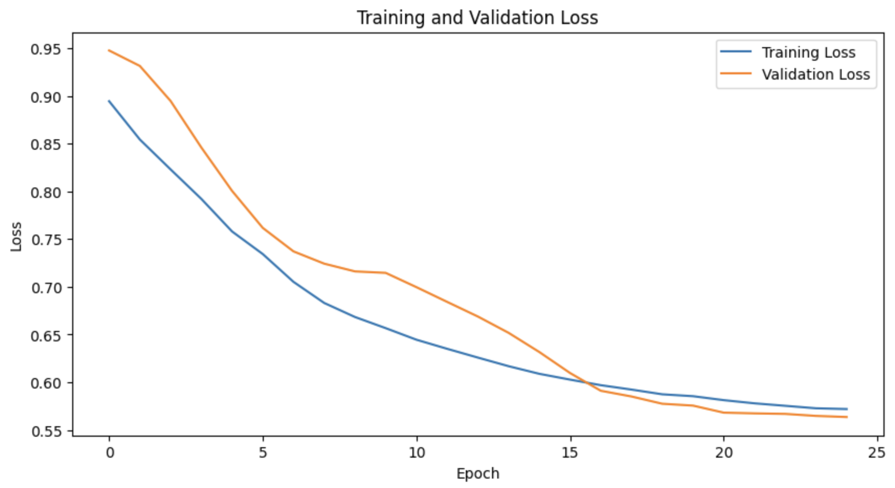
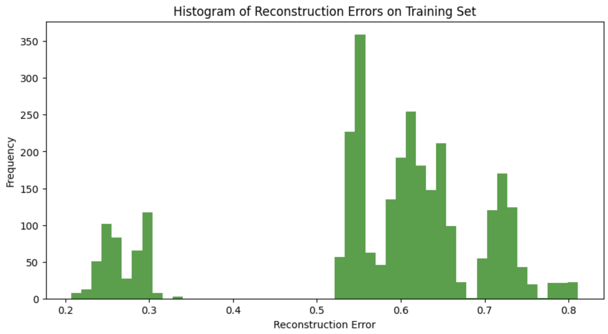

# Machine Anomaly Detection Using MVTec AD Dataset

## Introduction
Anomaly detection in machines is critical for identifying defects and irregularities in industrial settings, which is essential for maintaining the quality and efficiency of production processes. This project utilizes the MVTec AD dataset, an extensive collection of industrial images known for anomaly detection challenges. It features 15 different classes of objects and materials, totaling a dataset size of 4.9 GB.

## Project Overview
The project explores the application of deep learning techniques to detect anomalies in images of machine parts and surfaces. After reviewing several research papers in the field, this project implements and compares two main approaches:
1. A custom-designed Convolutional Neural Network (CNN).
2. A Convolutional Autoencoder (CAE).

Both models aim to identify and classify anomalies in industrial images effectively.

## Dataset
The dataset used is the MVTec AD dataset, which includes:
- **15 classes of images:** Each class represents a different type of object or material used in industrial applications.
- **Total size:** 4.9 GB.
- The MVTec AD dataset can be explored in detail [here](https://www.mvtec.com/company/research/datasets/mvtec-ad/downloads).

## Methodology
### Data Augmentation
To enhance the model's ability to generalize from the dataset,data augmentation is employed. This process increases the diversity of the training data without actually collecting new data, thereby improving the robustness of the models.

### Models
1. **Custom CNN Model:** Developed specifically for this project, this model was designed to capture the unique characteristics of industrial images.
2. **Convolutional Autoencoder:** Utilized for its ability to reconstruct input images and identify anomalies based on reconstruction errors.

### Evaluation
Both models were rigorously evaluated:
- The **CNN model** achieved an accuracy of approximately 62%.
- The **Convolutional Autoencoder** showed superior performance with an accuracy of 77.10%.
- 
- 

## Results
The project demonstrates that the Convolutional Autoencoder is more effective for anomaly detection in this context, providing a higher accuracy and better handling of the dataset's complexities.

## Conclusion
This comparative study highlights the potential of using advanced neural networks for anomaly detection in industrial applications. Future work could explore further enhancements in model architecture and training techniques to improve accuracy and efficiency.

## References
*This project is based on insights and methodologies discussed in various academic papers related to anomaly detection. Specific references to these papers can be found in the report.*
